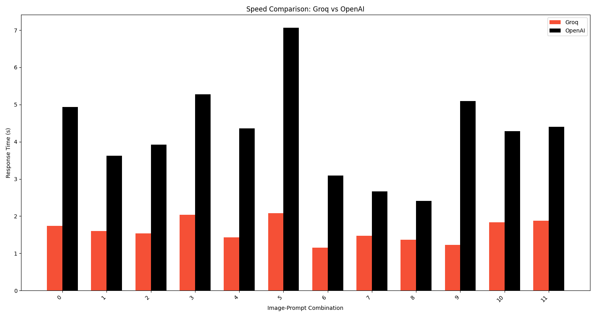
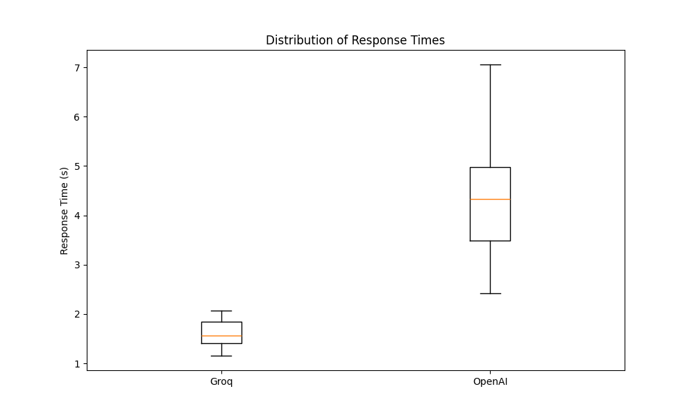
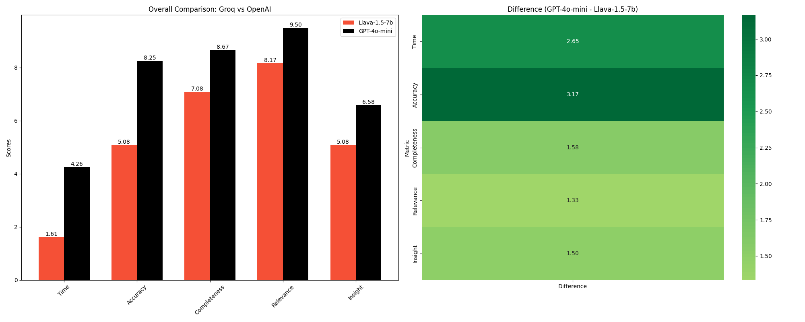

# Vision Model Comparison Report: LLaVA 1.5 7B (Groq) vs GPT-4o-mini (OpenAI)

## 1. Introduction and Objectives

This report presents a detailed comparison between two state-of-the-art vision models:

1. LLaVA 1.5 7B, provided by Groq and running on their custom Language Processing Unit (LPU)
2. GPT-4o-mini, provided by OpenAI

The primary objectives of this comparison are:

1. To evaluate the performance of Groq's LPU in terms of processing speed for vision tasks.
2. To assess the quality and accuracy of the LLaVA 1.5 7B model compared to GPT-4o-mini.
3. To determine if the potential loss in accuracy is outweighed by the significant speed improvements offered by the LPU.

Our goal is to provide insights into whether an open-source model like LLaVA 1.5 7B, when coupled with specialized hardware like the LPU, can serve as a viable and efficient alternative to larger, more resource-intensive models in scenarios where ultra-high accuracy is not critical.

## 2. Methodology


### 2.1 Test Images

We used FLUX-Schnell to generate four diverse images to test various aspects of the models' capabilities:

|  |  |
| :------------------------------------------------------: | :------------------------------------------------: |
|                   Complex Street Scene                   |                 Abstract Painting                  |
|                            |  |
|                         Receipt                          |                 Natural Landscape                  |

These images were chosen to evaluate the models' performance across different scenarios:

1. **Complex Street Scene**: Tests object detection and scene understanding in urban environments.
2. **Abstract Painting**: Evaluates interpretation of non-representational art and color analysis.
3. **Receipt**: Assesses OCR capabilities and information extraction from structured documents.
4. **Natural Landscape**: Examines detection of subtle details and understanding of natural scenes.

### 2.2 Prompts and Ground Truths

For each image, we prepared multiple prompts using the judge LLM (Claude 3.5 Sonnet) to test different aspects of the models' performance. The prompts were designed to evaluate various capabilities, including detailed description, counting, emotion interpretation, and information extraction.

```json
{
    "assets/complex_street_small.png": {
        "ground_truth": "Urban intersection with 7 cars, 3 traffic lights, and a prominent red brick building",
        "prompts": [
            "Describe the scene in detail.",
            "How many vehicles and traffic lights can you see?",
            "What's the most prominent building in the image?"
        ]
    },
    "assets/abstract_painting.png": {
        "ground_truth": "Abstract painting with swirling patterns in blue, red, and yellow, resembling a turbulent sky",
        "prompts": [
            "Describe the colors and patterns in this image.",
            "What emotions does this painting evoke?",
            "Can you identify any hidden shapes or figures in the painting?"
        ]
    },
    "assets/receipt.jpeg": {  
        "ground_truth": "Sales receipt from Cider Cellar showing 2 items (Bulmers Original Bottle and Bulmers Pear Bottle) each priced at £4.00, with discounts applied, resulting in a total of £4.50",
        "prompts": [
            "What is the name of the business on this receipt?",
            "List the items purchased and their individual prices.",
            "What is the total amount paid, and were any discounts applied?",
        ],
    },
    "assets/natural_landscape.png": {
        "ground_truth": "Forest scene with 3 hidden animals: a deer, an owl, and a fox. Dense foliage with a small stream running through.",
        "prompts": [
            "Describe the landscape in this image.",
            "Can you spot any hidden animals? If so, what are they?",
            "What time of day does this scene appear to be set in, and why?"
        ]
    }
}
```

### 2.3 Evaluation Process

1. **Image Encoding**: Each image was encoded to base64 format.
2. **Model Querying**: Both models were queried with each prompt for each image.
3. **Response Timing**: The time taken for each model to generate a response was recorded.
4. **Response Evaluation**: Claude 3.5 Sonnet was used as an impartial judge to evaluate the responses based on four criteria:
    - Accuracy (0-10): How well the response aligns with the ground truth
    - Completeness (0-10): How thoroughly the response addresses all aspects of the prompt
    - Relevance (0-10): How relevant the response is to the given prompt
    - Insight (0-10): Whether the response provides unique or insightful observations
5. **Data Collection**: All results, including response times and evaluation scores, were collected and saved to a CSV file.

## 3. Results and Analysis

### 3.1 Speed Comparison

|  |  |
| :------------------------------------------------------------: | :-----------------------------------------------------------: |
|                   Speed Comparison Bar Chart                   |                   Speed Comparison Box Plot                   |


The speed comparison clearly shows that the Groq LPU consistently outperforms OpenAI's model in terms of response time. Groq's model demonstrates a significant speed advantage, with an average response time of 1.61 seconds compared to OpenAI's 4.26 seconds, representing a speed improvement of approximately 2.6x.

### 3.2 Performance Metrics

|  |  |
| :------------------------------------------------------: | :------------------------------------------------------------------: |
|                 Performance Radar Chart                  |                    Performance Grouped Bar Chart                     |

The performance metrics show that while OpenAI's model generally scores higher across all evaluation criteria, the difference is not as substantial as the speed difference. Both models perform well in terms of relevance and completeness, with OpenAI having an edge in accuracy.

### 3.3 Overall Comparison



The parallel coordinates plot offers a comprehensive view of how the models compare across all metrics. It visualizes the trade-offs between speed and various performance aspects, highlighting Groq's superior speed and OpenAI's edge in accuracy and completeness.

### 3.4 Time Savings


This area chart illustrates the cumulative time savings achieved by using Groq's model. As the number of queries increases, the time saved becomes increasingly significant, demonstrating the potential efficiency gains in large-scale applications.

## 4. Summary Statistics

| Metric       | Groq (LLaVA 1.5-7b) | OpenAI (GPT-4o-mini) |
| :----------- | :------------------ | :------------------- |
| Time         | 1.61 ± 0.30         | 4.26 ± 1.27          |
| Accuracy     | 5.08 ± 2.23         | 8.25 ± 2.01          |
| Completeness | 7.08 ± 1.44         | 8.67 ± 1.50          |
| Relevance    | 8.17 ± 1.34         | 9.50 ± 0.80          |
| Insight      | 5.08 ± 2.87         | 6.58 ± 2.78          |

## 5. Conclusion

This comprehensive comparison between Groq's LLaVA 1.5 7B model running on their custom LPU and OpenAI's GPT-4o-mini yields several important insights:

1. **Speed**: Groq's model demonstrates a clear and significant advantage in processing speed, with an average response time 2.6 times faster than OpenAI's model. This speed improvement is crucial for real-time applications and large-scale deployments.

2. **Accuracy and Quality**: While OpenAI's model shows higher scores across all evaluation metrics, the difference is relatively small in most areas. However, it's important to note that the LLaVA model showed some weakness in OCR capabilities, particularly when reading detailed information from the receipt image.

3. **Efficiency vs. Accuracy Trade-off**: The loss in accuracy is offset by the substantial gain in speed. This trade-off could be highly favorable in many real-world applications where rapid response times are crucial and slight accuracy losses are acceptable.

4. **Scalability**: The time savings chart clearly illustrates that as the number of queries increases, the cumulative time saved by using Groq's model becomes increasingly significant. This could translate to substantial efficiency gains and cost savings in large-scale deployments.

5. **Consistency**: Both models show relatively consistent performance across different types of images and prompts, with some variance in accuracy and insight metrics.

In conclusion, the use of an open-source model like LLaVA 1.5 7B, when paired with specialized hardware like Groq's LPU, presents a compelling alternative to larger, more resource-intensive models. While there is a trade-off in terms of accuracy, particularly in OCR tasks, the massive gain in processing speed makes this solution highly attractive for a wide range of applications where real-time or near-real-time processing is essential.

It's important to note that the current limitations in OCR capabilities for the LLaVA model do not diminish the significant advantages in speed offered by the Groq LPU. As Groq continues to develop and potentially host larger or more specialized models, we can expect to see improvements in accuracy while maintaining the speed advantage. This could lead to a solution that combines both high speed and high accuracy, making it an even more attractive option for a broader range of applications.

This comparison demonstrates that in scenarios where ultra-high accuracy is not critical, or where the speed-accuracy trade-off favors faster processing, the combination of LLaVA 1.5 7B and Groq's LPU can provide a balance of speed and quality that may be preferable to slower, albeit slightly more accurate, alternatives. As AI continues to be integrated into more real-time applications, solutions that offer this balance of speed and accuracy will likely become increasingly valuable.
