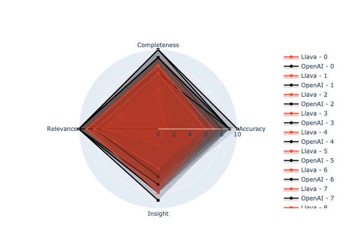
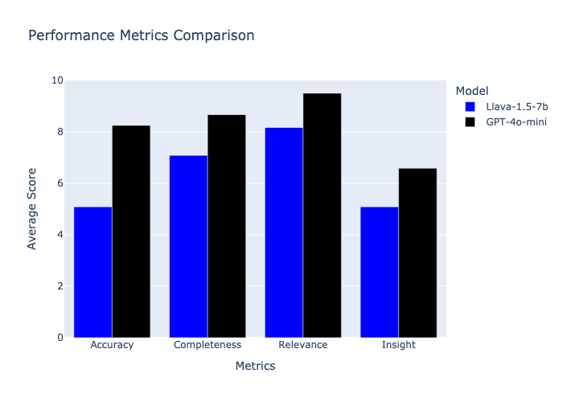
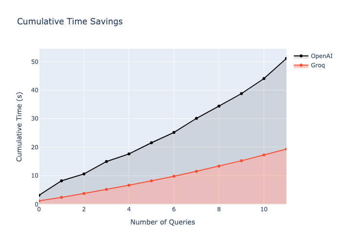

# Vision Model Comparison Report

## Overview
This report compares the performance of Groq and OpenAI vision models across various metrics.

## Speed Comparison

## Performance Metrics

## Overall Comparison

## Time Savings

## Summary Statistics
|       |   Groq_Time |   Groq_Accuracy |   Groq_Completeness |   Groq_Relevance |   Groq_Insight |   Groq_Total |   OpenAI_Time |   OpenAI_Accuracy |   OpenAI_Completeness |   OpenAI_Relevance |   OpenAI_Insight |   OpenAI_Total |
|:------|------------:|----------------:|--------------------:|-----------------:|---------------:|-------------:|--------------:|------------------:|----------------------:|-------------------:|-----------------:|---------------:|
| count |   12        |        12       |            12       |         12       |       12       |     12       |      12       |          12       |              12       |          12        |         12       |       12       |
| mean  |    1.61191  |         5.08333 |             7.08333 |          8.16667 |        5.08333 |     25.4167  |       4.2606  |           8.25    |               8.66667 |           9.5      |          6.58333 |       33       |
| std   |    0.304379 |         2.23437 |             1.44338 |          1.33712 |        2.87492 |      7.15362 |       1.27444 |           2.00567 |               1.49747 |           0.797724 |          2.77843 |        5.72078 |
| min   |    1.15474  |         1       |             4       |          5       |        0       |     14       |       2.41512 |           3       |               5       |           8        |          0       |       18       |
| 25%   |    1.41382  |         4.25    |             6.75    |          7.75    |        2.75    |     20.5     |       3.49375 |           8.5     |               8       |           9        |          6.75    |       30       |
| 50%   |    1.56457  |         6       |             7.5     |          8.5     |        6       |     26.5     |       4.32522 |           9       |               9       |          10        |          7.5     |       35.5     |
| 75%   |    1.84787  |         6.25    |             8       |          9       |        7.25    |     30.5     |       4.97627 |           9       |              10       |          10        |          8       |       37       |
| max   |    2.0745   |         8       |             9       |         10       |        8       |     35       |       7.05912 |          10       |              10       |          10        |          9       |       38       |

## Metric Comparison (Mean ± Std)

| Metric       | Groq (Llava 1.5-7b)   | OpenAI (Gpt-4o-mini)   |
|:-------------|:----------------------|:-----------------------|
| Time         | 1.61 ± 0.30           | 4.26 ± 1.27            |
| Accuracy     | 5.08 ± 2.23           | 8.25 ± 2.01            |
| Completeness | 7.08 ± 1.44           | 8.67 ± 1.50            |
| Relevance    | 8.17 ± 1.34           | 9.50 ± 0.80            |
| Insight      | 5.08 ± 2.87           | 6.58 ± 2.78            |